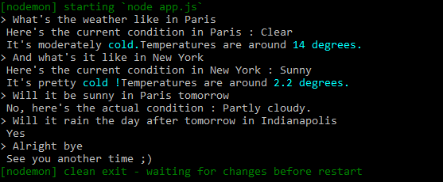

# Weather-Bot
> Get the current weather anywhere in the world.


## How To Use
- Clone this repository : `https://github.com/IlyessAgg/Weather-Bot`

```sh
❯ cd /path/to/workspace
❯ git clone git@github.com:IlyessAgg/Weather-Bot.git
```
- Install dependencies :

```
> npm i
```

- Launch the app :

```
> nodemon app.js
```


## Usage
```> What is the weather like in Paris
 Here's the current condition in Paris : Clear
 It's pretty cold !Temperatures are around 4 degrees.
```

It can also respond to questions like this : ```Will it rain in Paris tomorrow```\


<p align="center">
  
</p>
